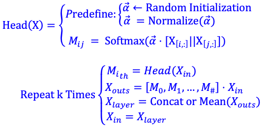

# Irregular Message Passing Networks
**CORE ISSUE**: Is the effectiveness of message passing uniquely tied to the well-designed GNN propagation weight? Or could a similar effect be achieved using some ”bad” edge weights?

In this work, we present the surprising positive impact of weight randomness on message passing. Through extensive experiments, we find that any normalized random edge weights (or graph attentions) can have a similar and, sometime, even stronger effect.

<p align="center">
  
</p>

## Overview

#### Random Weight Network (RWN):

<p align="center">
  
</p>

#### Random Attention Network (RAN):

<p align="center">
  
</p>

#### Random Multi-attention Network (RMN):

<p align="center">
  
</p>


## Explanation
The positive impact of normalized random weights on message passing is not serendipitous. The finding is: when random perturbations do not change the singular values of the original aggregator too much [Fig.2a vs Fig.2b], the random diffusion increases the diversity of structure-weighted feature fusion. 

 (We upload the Jupiter file of this part [Github\_random\_matrix\.ipynb] ，you can try the code!)

<p align="center">
  
</p>


## What Is The Difference Between Good Weights and Bad Weights?

1. For shallow iterations, there is no obvious difference between the well-designed weight and the normalized random weight [especially RAN vs GAT].
2. For deep iterations, the diagonalizable propagation weight is very important [DA vs RWN 👇].

<p align="center">
  
</p>

## My Experiment Environments
* [Python = 3.7](https://www.python.org/)
* [Pytorch = 1.5.0](https://pytorch.org)
* [Pytorch_Geometric = 1.5.0](https://pytorch-geometric.readthedocs.io/en/latest/)
* [Cuda = 10.2](https://pytorch.org)
* [GPU-> 'TITAN RTX'](https://pytorch.org)


## Code Architecture
    .F o l d e r
    ├── img                    # images for readme.md
    ├── data                   # benchmark networks 
    ├── Experiments 👇
    Experiment-Files:
       ├── Github_RWN.ipynb                 
       ├── Github_RAN.ipynb					
       ├── Github_RMN.ipynb
       ├── Github_MixRMN.ipynb
       ├── Github_random_matrix.ipynb
       ├── Github RWN-DA-DAD Random Test.ipynb
       ├── Github GCN-SAGE Random Feature Test.ipynb
    Other-Files:
       ├── karate_nx.edgelist
       ├── D_A_D.py
       ├── RWN_5_60_cora_300.txt
       ├── DA_5_60_cora_300.txt


## Citation
 Please cite our paper if you find anything helpful

```

```

## License
HIT License

## Contact
For more information please contact [Li Xue](https://www.researchgate.net/profile/Xue-Li-5), 
<p align="center">
  
</p>