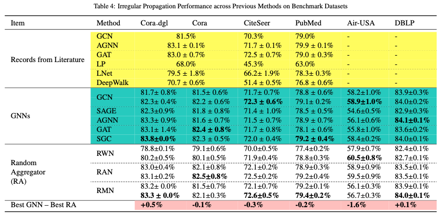
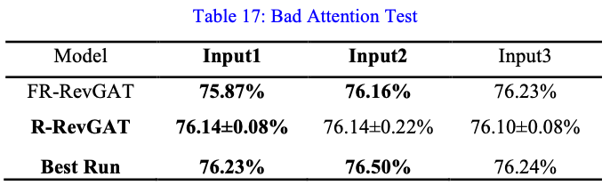

# Irregular Message Passing Networks
**CORE ISSUE**: ***Is the effectiveness of message passing uniquely tied to the well-designed GNN propagation weight? Or could a similar effect be achieved using some ”bad” edge weights?***

In this work, we present the surprisingly high tolerance of GNNs for irregular edge weights. Through extensive experiments, we find that any normalized random edge weights (or graph attentions) can have a similar and, sometime, even stronger effect.

  

**Graph nodes, constrained by the topology, do not need to control attentions!** To show this, we further design random attention models for another six popular attention models ranked at the top of the Open Graph Benchmark (OGB) leaderboard, and test them on ogbn-arxiv and ogbn-products datasets.

  

## Method Overview

#### Random Weight Network (RWN):

  

#### Random Attention Network (RAN):

  

#### Random Multi-attention Network (RMN):

  

## Attention? Random Attention Please!
We vary the variance of random attentions and hold learned parameters constant, running 1000 times, to observe the performance change. Table16 shows that **the randomness of attentions has a negligible effect on performance as a whole**.

  

The so-called “bad attentions” are not really worse as expected.

  

## My Experiment Environments
* [Python = 3.7](https://www.python.org/)
* [Pytorch = 1.5.0](https://pytorch.org)
* [Pytorch_Geometric = 1.5.0](https://pytorch-geometric.readthedocs.io/en/latest/)
* [Cuda = 10.2](https://pytorch.org)
* [GPU-> 'TITAN RTX'](https://pytorch.org)
* Recommend: Use jupyter notebook to see our ipynb file (not in GitHub!!)

## Code Architecture
    .F o l d e r
    ├── img                    # images for readme.md
    ├── data                   # benchmark networks 
    ├── Experiments 👇
    Experiment-Files:
       ├── Github_RWN.ipynb                 
       ├── Github_RAN.ipynb					
       ├── Github_RMN.ipynb
       ├── Github_MixRMN.ipynb
       ├── Github_random_matrix.ipynb
       ├── Github RWN-DA-DAD Random Test.ipynb
       ├── Github GCN-SAGE Random Feature Test.ipynb
    Other-Files:
       ├── karate_nx.edgelist
       ├── D_A_D.py
       ├── RWN_5_60_cora_300.txt
       ├── DA_5_60_cora_300.txt

## Citation
 Please cite our paper if you find anything helpful

## License
HIT License

## Contact
For more information please contact [Li Xue](https://www.researchgate.net/profile/Xue-Li-5), 

  

